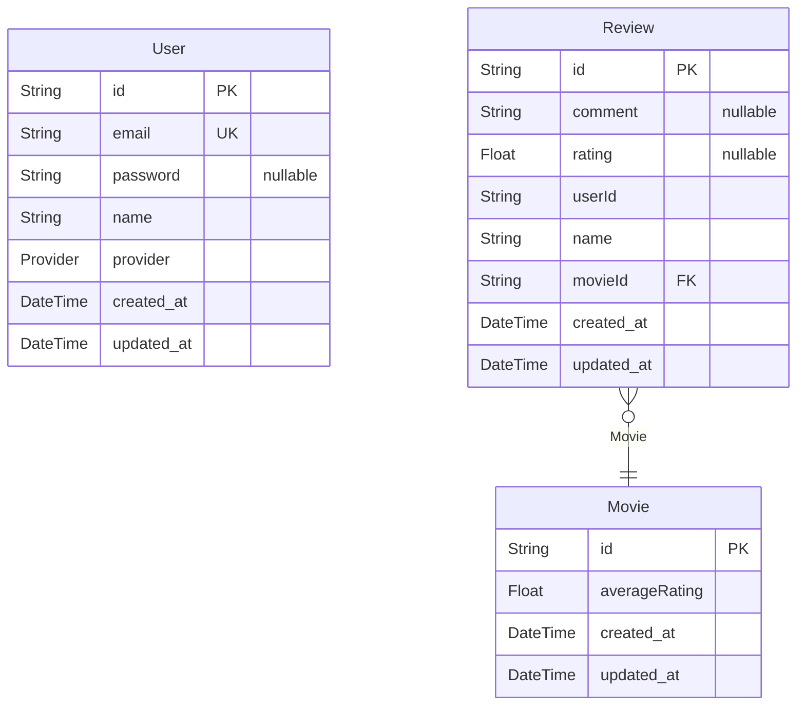

# moviepedia
> Generated by [`prisma-markdown`](https://github.com/samchon/prisma-markdown)

- [default](#default)

## default

### `User`

**Properties**
  - `id`: 
  - `email`: 
  - `password`: 
  - `name`: 
  - `provider`: 
  - `created_at`: 
  - `updated_at`: 

### `Movie`

**Properties**
  - `id`: 
  - `averageRating`: 
  - `created_at`: 
  - `updated_at`: 

### `Review`

**Properties**
  - `id`: 
  - `comment`: 
  - `rating`: 
  - `userId`: 
  - `name`: 
  - `movieId`: 
  - `created_at`: 
  - `updated_at`: 